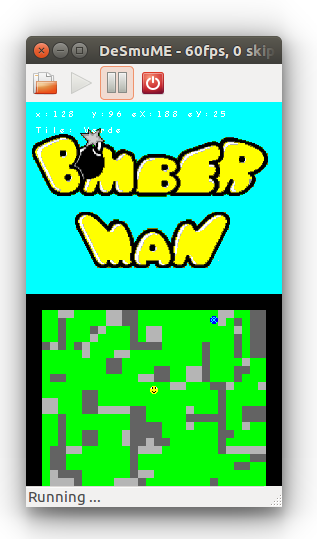

# NintendoDS_Bomberman

[Bomberman](https://en.wikipedia.org/wiki/Bomberman) fan-version developed by means of the Nintendo DS's [NightFox & Co.](http://www.nightfoxandco.com/) library.

Should you want to play this game on a linux machine, please execute *apt-get install desmume* to install the NintendoDS emulator and *desmume [bomberman.nds](https://github.com/gomezportillo/NintendoDS_Bomberman/blob/master/bomberman.nds)* to launch the game.

